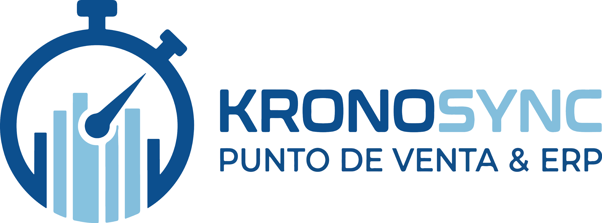

# Bienvenido a KronoSync

**ERP & POS** — Sistema integral de Punto de Venta, control de inventario y análisis financiero para el comercio chileno.

---

## ¿Qué es KronoSync?

KronoSync es una aplicación de escritorio que integra en un solo lugar la operación diaria de tu negocio: vender en caja, controlar el inventario, gestionar clientes y generar reportes contables. Está diseñado para funcionar **sin conexión a internet**, en equipos Windows comunes.

## ¿Para quién es?

- Pequeños y medianos comercios (minimarkets, ferreterías, tiendas de repuestos, retail)
- Negocios que operan en locales sin internet o con conectividad limitada
- Empresas chilenas que requieren validación de RUT, IVA 19% y formato CLP

## Módulos incluidos

| Módulo | ¿Qué hace? | Documentación |
|--------|------------|:---:|
| Dashboard (Inicio) | Estadísticas del día, alertas unificadas, panel financiero con gráficos | [Ver](modulos/dashboard.md) |
| Punto de Venta (POS) | Carrito de compras, cobro con múltiples métodos de pago, boleta PDF 80mm | [Ver](modulos/ventas.md) |
| Inventario | Control de stock, sistema FEFO, lotes, alertas de vencimiento | [Ver](modulos/inventario.md) |
| Clientes | Registro y búsqueda de clientes, validación de RUT chileno (Módulo 11) | [Ver](modulos/clientes.md) |
| Reportes | Historial de ventas con filtros, exportación Excel contable con desglose de IVA | [Ver](modulos/reportes.md) |
| Alertas | Centro de inteligencia de stock: productos bajo mínimo y próximos a vencer | [Ver](modulos/alertas.md) |
| Usuarios | Gestión de cuentas con control de acceso por roles, auditoría de sesiones | [Ver](modulos/usuarios.md) |
| Configuración | Datos de la empresa, respaldo de base de datos | [Ver](primeros-pasos/configuracion.md) |
| Compras | Pedidos a proveedores y recepción de mercancía | Próximamente |

## Roles de usuario

| Rol | Descripción |
|-----|-------------|
| **ADMIN** | Control total: todas las funciones, gestión de usuarios, configuración y backup |
| **DUENO** | Dashboard, inventario completo, POS, reportes, alertas (sin gestión de usuarios) |
| **ADMINISTRADOR** | Dashboard, inventario (editar, sin crear ni eliminar), POS, reportes, alertas |
| **CAJERO** | Home, Punto de Venta, inventario solo lectura (sin ver costo), alertas |

## Cómo usar esta ayuda

Usa la **barra lateral izquierda** para navegar entre secciones. También puedes usar el **buscador** (barra superior) para encontrar cualquier tema escribiendo palabras clave como "anular", "FEFO", "backup" o "RUT".

### Si es tu primera vez

1. [Instalación](primeros-pasos/instalacion.md) — requisitos y puesta en marcha
2. [Configuración inicial](primeros-pasos/configuracion.md) — datos de tu empresa
3. [Tu primera venta](primeros-pasos/primera-venta.md) — tutorial paso a paso en 5 minutos

### Si ya conoces el sistema

| Quiero... | Ve a... |
|-----------|---------|
| Ver cómo va el negocio hoy | [Dashboard](modulos/dashboard.md) |
| Hacer una venta | [Punto de Venta](modulos/ventas.md) |
| Revisar el stock | [Inventario](modulos/inventario.md) |
| Buscar un cliente | [Clientes](modulos/clientes.md) |
| Sacar un reporte para el contador | [Reportes](modulos/reportes.md) |
| Ver alertas de stock | [Alertas](modulos/alertas.md) |
| Crear un usuario nuevo | [Gestión de Usuarios](modulos/usuarios.md) |
| Hacer un respaldo | [Ajustes del Negocio](primeros-pasos/configuracion.md) |
| Resolver un problema | [Preguntas frecuentes](faq.md) |

!!! tip "Atajo recomendado"
    Si ya instalaste el sistema, ve directo a [Tu primera venta](primeros-pasos/primera-venta.md) para aprender el flujo completo en 5 minutos.

## Stack tecnológico

- **Lenguaje:** Python 3.13
- **Interfaz:** CustomTkinter (modo oscuro/claro automático)
- **Base de datos:** SQLite 3 (local, sin servidor)
- **PDF:** ReportLab (boletas térmicas 80mm)
- **Excel:** OpenPyXL (reportes contables)
- **Gráficos:** Matplotlib (dashboard financiero)
- **Seguridad:** Bcrypt (hash de contraseñas)

## Versión actual

**v1.0.0** — Licencia Privada
