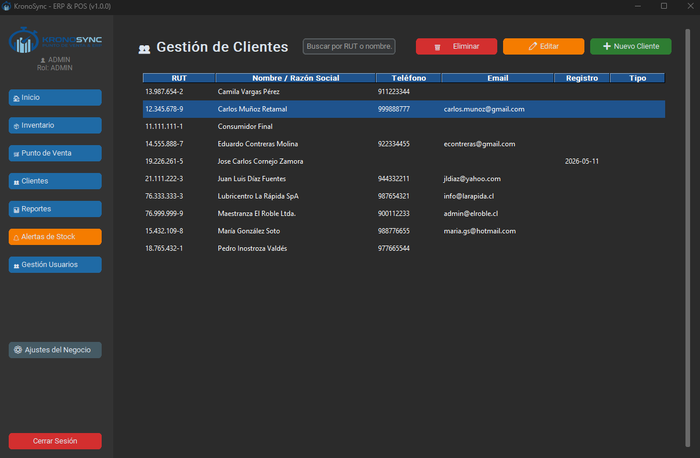
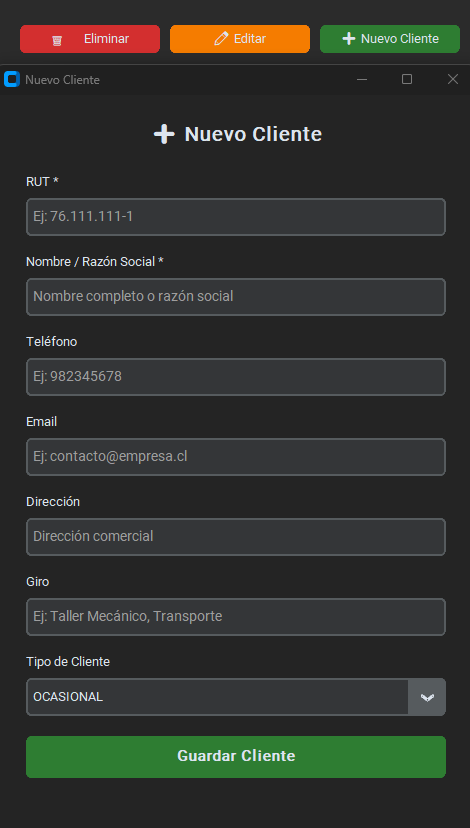

# Módulo de Clientes

El módulo de Clientes te permite gestionar la cartera completa de clientes: registrar nuevos, editar datos, buscar por RUT o nombre, y clasificar por tipo de cliente. Incluye validación de RUT chileno (Módulo 11) en cada operación.

{: style="width: 700px; height: auto;"}

---

## Acceso

Disponible para los roles **ADMIN**, **DUENO** y **ADMINISTRADOR**. El rol CAJERO no tiene acceso a este módulo, aunque puede registrar clientes nuevos desde el Punto de Venta durante una venta.

---

## Componentes de la pantalla

| Elemento | Función |
|----------|---------|
| Campo de búsqueda | Filtra en tiempo real por RUT o nombre |
| Tabla de clientes | 6 columnas con todos los datos |
| Botón Nuevo Cliente | Abre el formulario de registro |
| Botón Editar | Modifica los datos del cliente seleccionado |
| Botón Eliminar | Elimina al cliente seleccionado (con confirmación) |

### Columnas de la tabla

| Columna | Contenido |
|---------|-----------|
| RUT | RUT formateado con puntos y guión |
| Nombre / Razón Social | Nombre completo o razón social |
| Teléfono | Número de contacto |
| Email | Correo electrónico |
| Registro | Fecha de creación del cliente |
| Tipo | OCASIONAL, FRECUENTE o MAYORISTA |

!!! tip "Búsqueda instantánea"
    Escribe en el campo de búsqueda y la tabla se filtra automáticamente mientras escribes. Busca por RUT (ej: `76.111`) o por nombre (ej: `mecánica`).

---

## Agregar un cliente

1. Haz clic en **Nuevo Cliente**.
2. Se abre el formulario modal con los siguientes campos:

| Campo | Descripción | Obligatorio |
|-------|-------------|:-----------:|
| RUT | RUT del cliente (ej: `76.111.111-1`) | Sí |
| Nombre / Razón Social | Nombre completo o razón social | Sí |
| Teléfono | Número de contacto (ej: `982345678`) | No |
| Email | Correo electrónico | No |
| Dirección | Dirección comercial | No |
| Giro | Giro del negocio (ej: `Taller Mecánico`) | No |
| Tipo de Cliente | OCASIONAL, FRECUENTE o MAYORISTA | No (default: OCASIONAL) |

3. Completa los campos y haz clic en **Guardar Cliente**.

{: style="width: 400px; height: auto;"}

### Validación de RUT

El sistema valida automáticamente el RUT con el algoritmo de **Módulo 11** chileno:

- Rechaza RUTs con dígito verificador incorrecto
- Acepta entrada con o sin puntos y guión
- Formatea automáticamente a `XX.XXX.XXX-X` al guardar

!!! warning "RUT duplicado"
    No puedes crear dos clientes con el mismo RUT. Si el RUT ya existe, debes editar el cliente existente.

---

## Editar un cliente

1. Selecciona un cliente en la tabla.
2. Haz clic en **Editar** (o doble clic sobre la fila).
3. Se abre el formulario modal con los datos actuales precargados.
4. El campo RUT aparece bloqueado (no se puede modificar).
5. Cambia los campos necesarios y guarda.

---

## Eliminar un cliente

1. Selecciona el cliente en la tabla.
2. Haz clic en **Eliminar**.
3. Confirma la acción en el diálogo.

!!! danger "Consumidor Final protegido"
    El cliente **Consumidor Final** (RUT `11.111.111-1`) no puede ser eliminado. Es un registro protegido del sistema.

!!! warning "Eliminación irreversible"
    Esta acción no se puede deshacer. El cliente se elimina de la base de datos permanentemente. Se registra en la auditoría.

---

## Tipos de cliente

| Tipo | Uso típico |
|------|-----------|
| **OCASIONAL** | Cliente de paso, compra esporádica (valor por defecto) |
| **FRECUENTE** | Cliente recurrente, compra regularmente |
| **MAYORISTA** | Cliente que compra por volumen, posible precio especial |

!!! tip "Clasificación para reportes"
    El tipo de cliente te permite segmentar tus reportes y analizar qué tipo de cliente genera más ingresos.

---

## Integración con el Punto de Venta

El módulo de Clientes está integrado con Ventas de dos formas:

1. **Búsqueda en caja**: al escribir un RUT en el POS y presionar Enter, el sistema consulta la tabla de clientes y autocompleta el nombre.
2. **Registro automático**: si durante una venta se ingresa un RUT nuevo con su nombre, el cliente se registra automáticamente al confirmar el cobro.

De esta forma, tu cartera de clientes crece naturalmente con cada venta.

---

## Registro de auditoría

Toda operación sobre clientes queda registrada:

- `NUEVO CLIENTE`: al crear un cliente
- `ACTUALIZAR CLIENTE`: al editar datos
- `ELIMINAR CLIENTE`: al eliminar un cliente

Los logs incluyen el RUT y nombre del cliente afectado.
