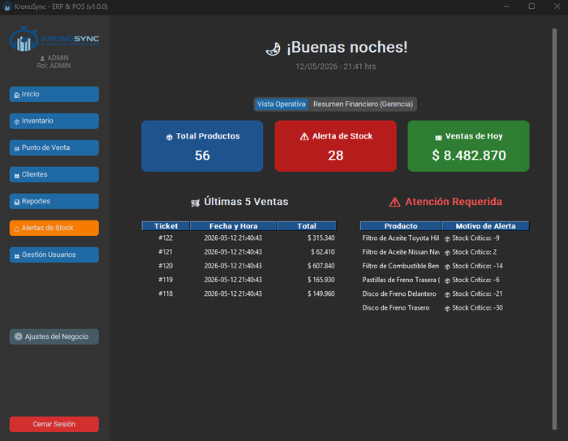
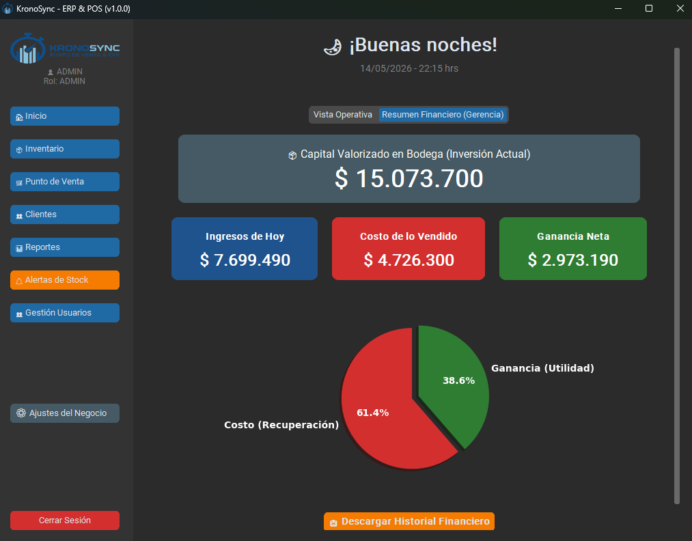

# Módulo Dashboard (Inicio)

El Dashboard es la pantalla principal que ves al iniciar sesión. Presenta un resumen del estado actual del negocio: estadísticas clave, últimas ventas, alertas activas y, para el rol ADMIN, un panel financiero completo con gráficos.

{: style="width: 700px; height: auto;"}

---

## Acceso

Todos los roles pueden ver el Dashboard. Sin embargo, el **panel financiero** (capital en bodega, flujo de caja, ganancia neta y gráfico de torta) solo es visible para el rol **ADMIN**.

---

## Componentes de la pantalla

### Saludo y fecha

La parte superior muestra:

- **Saludo dinámico** según la hora del día:
    - ☀️ ¡Buenos días! (antes de las 12:00)
    - 🌤️ ¡Buenas tardes! (12:00 a 18:59)
    - 🌙 ¡Buenas noches! (19:00 en adelante)
- **Fecha y hora actual** (formato: `DD/MM/YYYY - HH:MM hrs`)

### Tarjetas de estadísticas

| Tarjeta | ¿Qué mide? | Cálculo |
|---------|-----------|---------|
| Total Productos | Productos en catálogo | Conteo de todos los registros en inventario |
| Alertas Pendientes | Productos bajo stock mínimo | Productos donde `stock_actual <= stock_minimo` |
| Ventas del Día | Ingresos del día actual | Suma de ventas COMPLETADAS con fecha de hoy |

### Últimas 5 ventas

Tabla resumen con las 5 ventas más recientes, mostrando:

- N° de ticket
- Fecha y hora
- Total en CLP
- Nombre del cliente

!!! tip "Acceso rápido al detalle"
    Desde esta tabla no se puede hacer clic para ver el detalle. Para ver el ticket completo, ve al módulo **Reportes**.

### Alertas unificadas

Una tarjeta que consolida dos tipos de alertas en una sola vista (máximo 6 elementos):

| Tipo | Icono | Origen |
|------|-------|--------|
| Caducidad / Lote | ⚠️ | Productos perecederos próximos a vencer |
| Stock Crítico | 📦 | Productos bajo el stock mínimo |

Las alertas de **caducidad** se generan automáticamente al cargar el Dashboard, basándose en el parámetro de **días de alerta** configurado en Ajustes del Negocio.

---

## Panel financiero (solo ADMIN)

El Dashboard incluye una sección exclusiva para el rol ADMIN con análisis de rentabilidad, organizada en **dos pestañas**:

| Pestaña | Contenido |
|---------|-----------|
| **Vista Operativa** | Tarjetas de estadísticas (productos, alertas, ventas del día), últimas 5 ventas, alertas unificadas |
| **Resumen Financiero (Gerencia)** | Capital en bodega, flujo de caja, ganancia neta, gráfico de torta Matplotlib |

📷 *[Dashboard con pestañas ADMIN — pendiente de subir]*

### Indicadores financieros

| Indicador | Fórmula | Descripción |
|-----------|---------|-------------|
| **Capital en bodega** | Σ (precio_compra × stock_actual) | Valorización total del inventario a precio de costo |
| **Flujo de caja** | Σ ventas del día | Ingresos totales por ventas del día actual |
| **Ganancia neta** | Flujo de caja − Costo de lo vendido | Utilidad real del día |

!!! info "Cálculo del costo"
    El sistema calcula el costo de lo vendido multiplicando el precio de compra de cada producto por la cantidad vendida, para todas las ventas completadas del día. Esto permite ver la ganancia neta real, no solo los ingresos.

### Gráfico de torta (Matplotlib)

Un gráfico circular que compara visualmente:

- **Costo de lo Vendido** (rojo): lo que te costó la mercancía vendida hoy
- **Ganancia Neta** (verde): la utilidad generada hoy

Este gráfico se genera con Matplotlib y se renderiza dentro de la interfaz.

{: style="width: 700px; height: auto;"}

---

## Exportación financiera (solo ADMIN)

El Dashboard permite exportar un reporte financiero en Excel:

1. Haz clic en **Exportar** dentro del panel financiero.
2. Selecciona año y mes (o "Todos").
3. Elige ubicación para guardar el archivo.
4. Se genera un Excel con el nombre `Reporte_financiero_DD_MM_YYYY_HH-MM.xlsx`.

### Contenido del Excel

| Columna | Descripción |
|---------|-------------|
| Período | Mes y año seleccionados |
| Ingresos Totales | Suma de ventas del período |
| Costo de lo Vendido | Suma de costos de productos vendidos |
| Ganancia Neta (Utilidad) | Ingresos − Costo |

!!! tip "Listo para el contador"
    Este reporte complementa al Excel de ventas del módulo Reportes. Úsalo para tener una visión rápida de rentabilidad por período.

---

## ¿Qué hace el Dashboard al cargar?

Cada vez que entras al Dashboard (o recargas), el sistema ejecuta estas operaciones en orden:

1. Calcula el saludo según la hora actual.
2. Cuenta productos totales en el catálogo.
3. Detecta productos bajo stock mínimo.
4. Suma las ventas del día actual.
5. Genera alertas de vencimiento automáticas (basadas en los días configurados).
6. Unifica alertas de caducidad + stock bajo en la tarjeta de alertas.
7. Si el rol es ADMIN: calcula capital en bodega, costo de lo vendido y ganancia neta, y renderiza el gráfico de torta.

```python
# controllers/home_controller.py:23-96
def cargar_estadisticas(self):
    # 1. Saludo dinámico
    # 2. Conteo de productos y alertas
    # 3. Cálculo de ventas del día
    # 4. Unificación de alertas (caducidad + stock)
    # 5. Panel financiero (solo ADMIN): capital, costo, ganancia, gráfico
```

---

## Navegación relacionada

- Las alertas de stock se gestionan en el [Centro de Alertas](alertas.md)
- El historial completo de ventas está en [Reportes](reportes.md)
- Para ver el detalle de un ticket, usa el módulo [Reportes](reportes.md)
