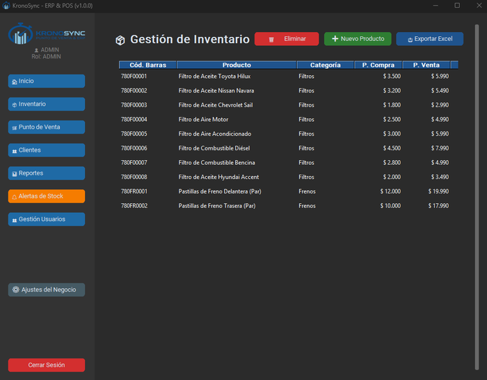
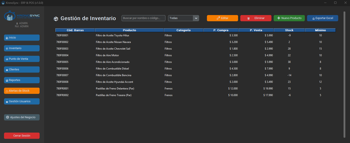
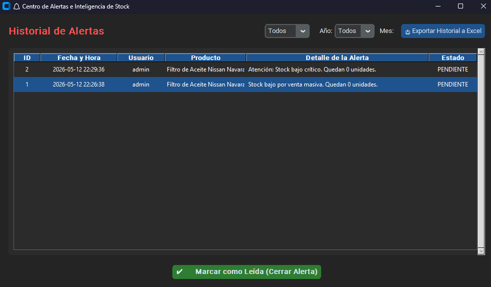

# Módulo de Inventario

El módulo de Inventario te permite gestionar todo el catálogo de productos, controlar el stock en tiempo real, administrar lotes con sistema FEFO y recibir alertas de stock bajo y vencimiento.

{: style="width: 700px; height: auto;"}

---

## Acceso y permisos

| Rol | Ver | Crear | Editar | Eliminar | Exportar | Ver costo |
|-----|:---:|:-----:|:------:|:--------:|:--------:|:---------:|
| ADMIN | Sí | Sí | Sí | Sí | Sí | Sí |
| DUENO | Sí | Sí | Sí | Sí | Sí | Sí |
| ADMINISTRADOR | Sí | No | Sí | No | Sí | Sí |
| CAJERO | Sí | No | No | No | No | No |

!!! note "Rol CAJERO"
    Los cajeros solo pueden ver el inventario para consultar stock y precios de venta. No ven el precio de compra (costo) ni pueden modificar productos.

---

## Componentes de la pantalla

| Elemento | Función |
|----------|---------|
| Campo de búsqueda | Filtra productos por nombre o código |
| Combo de categoría | Filtra por categoría (Filtros, Frenos, Lubricantes, etc.) |
| Tabla de productos | 7 columnas: Código, Nombre, Categoría, Stock, Precio Venta, Vencimiento, Precio Compra |
| Botón Nuevo | Abre el formulario de alta de producto (ADMIN/DUENO) |
| Botón Exportar | Genera plantilla Excel para inventario físico |
| Botón Ver Lotes | Abre la ventana de gestión de lotes del producto seleccionado |

---

## Categorías de productos

Las categorías se gestionan dinámicamente. Al crear o editar un producto, el combo de categorías muestra las existentes y permite escribir una nueva.

Algunas categorías típicas (del seeder de repuestos mecánicos):

- Filtros
- Frenos
- Lubricantes
- Correas y Cadenas
- Bujías y Encendido
- Baterías
- Suspensión y Dirección
- Motor

!!! tip "Crear nueva categoría"
    Simplemente escribe el nombre de la nueva categoría en el combo del formulario de producto. La categoría se crea automáticamente si no existe.

---

## Agregar un producto

Haz clic en **Nuevo** (visible solo para ADMIN y DUENO). Se abre el formulario con los siguientes campos:

| Campo | Descripción | Requerido |
|-------|-------------|:---------:|
| Código de Barras | Identificador único del producto | Sí |
| Nombre | Nombre descriptivo | Sí |
| Categoría | Selecciona o escribe una categoría | Sí |
| Precio de Compra | Costo de adquisición (no visible para CAJERO) | Sí |
| Precio de Venta | Precio final con IVA incluido | Sí |
| Stock Inicial | Cantidad inicial en bodega | Opcional (default: 0) |
| Stock Mínimo | Umbral para alertas de stock bajo | Opcional (default: 5) |
| ¿Es perecedero? | Switch ON/OFF. Si es ON, aparece el selector de fecha | No |

{: style="width: 700px; height: auto;"}

!!! warning "Código de barras único"
    No puedes crear dos productos con el mismo código de barras. El sistema rechazará el duplicado.

---

## Productos perecederos y lotes (FEFO)

KronoSync implementa **FEFO** (First Expire, First Out): al vender un producto con fecha de vencimiento, el sistema descuenta automáticamente las unidades del lote que vence primero.

### Activar perecedero

En el formulario de producto, activa el switch **¿Es perecedero?**. Aparecerá un selector de fecha de vencimiento donde puedes elegir el día, mes y año.

### Cómo funciona FEFO

- Cada producto perecedero puede tener múltiples **lotes** con distintas fechas de vencimiento.
- Al registrar una venta, el sistema descuenta primero del lote con fecha más próxima.
- Si un lote se agota, continúa con el siguiente lote más antiguo.
- Los productos sin vencimiento (no perecederos) no usan lotes y se descuentan directamente del stock.

!!! tip "Ejemplo FEFO"
    Tienes 10 unidades de "Líquido de Freno DOT-4" que vencen en diciembre, y compras 20 unidades más que vencen en marzo del año siguiente. Al vender, el sistema siempre tomará primero las de diciembre.

---

## Editar un producto

1. Selecciona un producto en la tabla.
2. Haz clic derecho o usa el botón de edición (según tu rol).
3. Modifica los campos necesarios.
4. Confirma para guardar los cambios.

Disponible para ADMIN, DUENO y ADMINISTRADOR.

---

## Eliminar un producto

1. Selecciona el producto en la tabla.
2. Usa el botón de eliminar (ADMIN/DUENO).
3. Confirma la eliminación.

!!! danger "Eliminación permanente"
    Esta acción es irreversible. El producto se elimina de la base de datos junto con todos sus lotes y registros asociados. Se registra en la auditoría como evento crítico.

---

## Exportar inventario físico (Excel)

El botón **Exportar** genera una plantilla Excel multi-hoja para realizar conteos físicos de inventario:

1. Haz clic en **Exportar**.
2. Elige categoría (o "Todas") y año de vencimiento (o "Todos").
3. Selecciona dónde guardar el archivo.
4. El Excel se genera con **una pestaña por categoría**.

### Columnas de la plantilla

| Columna | Contenido |
|---------|-----------|
| CÓDIGO | Código de barras |
| PRODUCTO | Nombre del producto |
| VENCIMIENTO | Fecha de vencimiento (o N/A) |
| STOCK SISTEMA | Cantidad registrada en KronoSync |
| STOCK FÍSICO | Celda amarilla para anotar el conteo manual |
| DIFERENCIA | Fórmula automática: `Stock Físico - Stock Sistema` |

!!! tip "Uso de la plantilla"
    Imprime el Excel, recorre la bodega anotando el stock físico real, y luego ajusta las diferencias en el sistema editando cada producto.

---

## Alertas de inventario

El sistema genera alertas automáticas en dos situaciones:

### Stock bajo

Cuando el stock de un producto cae por debajo de su **stock mínimo**, se registra una alerta. Esto puede ocurrir:

- Al registrar una venta que deja el stock bajo el umbral
- Al hacer una venta masiva que agota gran parte del inventario

### Vencimiento próximo

Los productos perecederos cuya fecha de vencimiento está dentro de los próximos **N días** (configurable en Ajustes del Negocio) generan alertas.

Ambos tipos de alertas se consultan en el [Centro de Alertas](alertas.md) (botón naranja en la barra lateral).

---

## Gestión de lotes

Desde la tabla de inventario, puedes acceder a la gestión visual de lotes de cualquier producto:

1. Selecciona un producto en la tabla.
2. Haz clic en **Ver Lotes**.
3. Se abre la ventana de [Gestión de Lotes](lotes.md) con:
    - Cabecera del producto (nombre, código, stock total, precio)
    - Indicador de disponibilidad (🟢/🟡/🔴)
    - Tabla de lotes con código, cantidad y fecha de vencimiento
    - Botones para agregar, editar y eliminar lotes

!!! info "Generación automática de alertas"
    Las alertas de vencimiento se generan automáticamente cada vez que cargas el Dashboard (Inicio), basándose en el parámetro de días configurado. Las alertas de stock bajo se generan en tiempo real durante las ventas.

{: style="width: 700px; height: auto;"}

---

## Sistema de auditoría

Toda operación sobre inventario queda registrada en los logs de auditoría:

- Creación de producto: `NUEVO PRODUCTO`
- Edición: `ACTUALIZAR PRODUCTO`
- Eliminación: `ELIMINAR PRODUCTO` (nivel CRÍTICO)
- Exportación: `EXPORTACIÓN INVENTARIO MULTI-PESTAÑA`

Los logs se almacenan en la carpeta `.logs_locales/` con rotación mensual.

---

## Navegación relacionada

- [Punto de Venta](ventas.md): cómo el sistema FEFO descuenta lotes durante las ventas
- [Alertas](alertas.md): gestiona las alertas de stock bajo y vencimiento
- [Dashboard](dashboard.md): ve el capital en bodega y las alertas unificadas
- [Reportes](reportes.md): analiza el historial de ventas por producto
