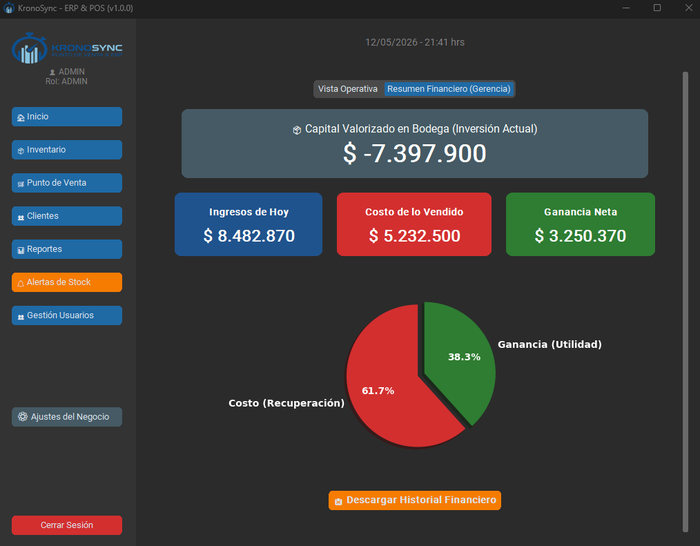
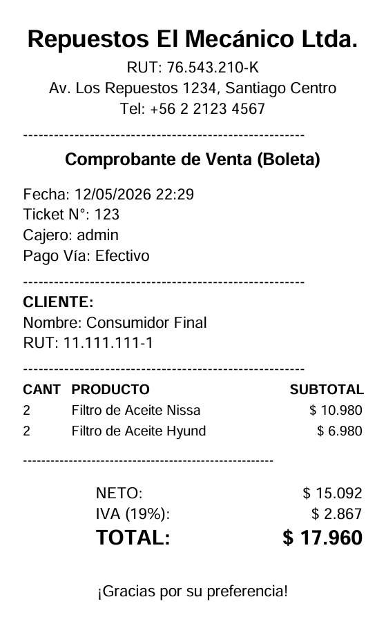

# Módulo de Reportes

El módulo de Reportes te permite consultar el historial completo de ventas, ver el detalle de cada ticket, anular ventas y exportar información contable a Excel con desglose de IVA.

{: style="width: 700px; height: auto;"}

---

## Acceso

Disponible para los roles **ADMIN**, **DUENO** y **ADMINISTRADOR**. El rol CAJERO no tiene acceso a este módulo.

---

## Componentes de la pantalla

| Elemento | Función |
|----------|---------|
| Combo Año | Filtra ventas por año (se llena automáticamente con los años existentes en la BD) |
| Combo Mes | Filtra por mes (Todos, 01-12) |
| Tabla de ventas | 7 columnas con el historial |
| Total ingresos válidos | Suma de ventas COMPLETADAS en los filtros actuales |
| Botón Exportar | Genera Excel contable con desglose de IVA |

### Columnas de la tabla

| Columna | Contenido |
|---------|-----------|
| N° Ticket | Número correlativo con # |
| Fecha | Fecha y hora de la venta |
| Vendedor | Usuario que realizó la venta |
| Estado | COMPLETADA o ANULADA |
| Total | Monto total en CLP |
| Cliente | Nombre del cliente |
| Método | Efectivo, Tarjeta o Transferencia |

---

## Filtros

Los filtros se aplican automáticamente al seleccionar un valor en los combos. No requieren botón de "Buscar".

- **Año**: el combo se llena dinámicamente con los años que tienen ventas registradas. Incluye la opción "Todos".
- **Mes**: valores del 01 al 12, más "Todos".

!!! tip "Combinar filtros"
    Puedes filtrar solo por año (dejando Mes en "Todos"), solo por mes (con Año en "Todos"), o ambos simultáneamente.

---

## Ver detalle de un ticket

Haz **doble clic** sobre cualquier venta en la tabla para abrir el detalle completo:

{: style="width: 400px; height: auto;"}

### Información mostrada

| Sección | Contenido |
|---------|-----------|
| Cabecera | Datos de la empresa (nombre, RUT, dirección, teléfono) |
| Datos de venta | N° ticket, fecha, vendedor, método de pago |
| Datos del cliente | RUT y nombre |
| Tabla de productos | Código, producto, cantidad, precio unitario, subtotal |
| Resumen financiero | Subtotal (sin IVA), IVA (19%), Total |
| Estado | COMPLETADA o ANULADA (con indicador visual) |

### Acciones disponibles

| Acción | Botón | Disponible para |
|--------|-------|----------------|
| Ver PDF | Abre la boleta PDF generada en el visor predeterminado | Todos |
| Anular Venta | Revierte el descuento de stock y marca como ANULADA | ADMIN, DUENO, ADMINISTRADOR |

---

## Anular una venta

1. Haz doble clic en la venta para abrir el detalle.
2. Haz clic en **Anular Venta**.
3. Confirma la acción.

!!! danger "Efectos de la anulación"
    - La venta se marca como `ANULADA` (no se elimina de la base de datos).
    - El stock de los productos vendidos **se revierte** al inventario automáticamente.
    - La venta aparece en rojo y tachada en el historial y en los reportes Excel.
    - Esta acción **no se puede deshacer**. Una vez anulada, no hay forma de reactivar la venta.

---

## Exportar a Excel (reporte contable)

El botón **Exportar** genera un archivo Excel con todas las ventas visibles según los filtros activos.

### Contenido del Excel

| Columna | Descripción |
|---------|-------------|
| N° Ticket | Número de venta |
| Fecha y Hora | Timestamp completo |
| Vendedor | Usuario |
| Estado | COMPLETADA o ANULADA |
| Monto Neto | Valor sin IVA |
| IVA (19%) | Impuesto calculado |
| Total Venta | Monto total con IVA |

Al final del archivo se incluye una **fila de totales** con la suma de Neto, IVA y Total de todas las ventas válidas (excluye ANULADAS).

### Formato

- Ventas **ANULADAS** aparecen en texto rojo y tachadas.
- Las columnas de montos usan formato de moneda (`$ 1.234`).
- El archivo se guarda con el nombre `Reporte_Contable_Ventas_DD_MM_YYYY.xlsx`.

!!! tip "Listo para el contador"
    Este reporte está diseñado para entregarse directamente al contador, con el desglose de IVA que exige el SII.

---

---

## Navegación relacionada

- [Dashboard](dashboard.md): panel de inicio con estadísticas, capital en bodega y gráfico de torta financiero
- [Alertas](alertas.md): centro de inteligencia de stock con exportación BI
- [Punto de Venta](ventas.md): dónde se originan las ventas que aquí analizas
- [Inventario](inventario.md): para verificar el stock de los productos vendidos
