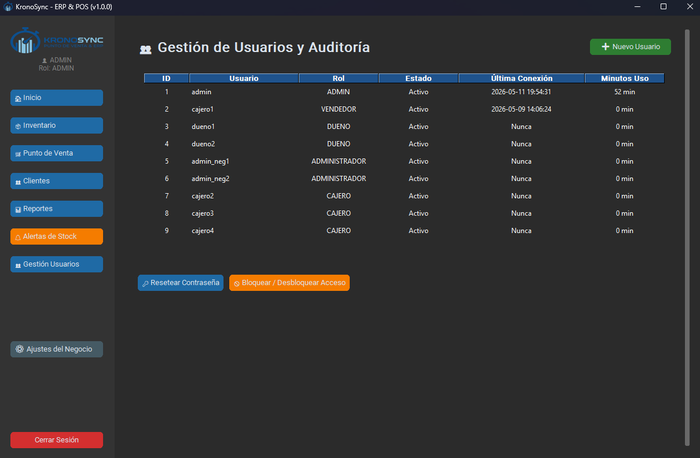
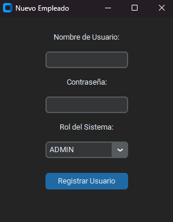

# Módulo de Usuarios

El módulo de Gestión de Usuarios te permite administrar las cuentas del sistema: crear nuevos usuarios, restablecer contraseñas, activar o bloquear accesos, y monitorear el tiempo de uso de cada empleado.

{: style="width: 700px; height: auto;"}

---

## Acceso

Exclusivo del rol **ADMIN**. Los roles DUENO, ADMINISTRADOR y CAJERO no pueden ver ni acceder a este módulo.

---

## Componentes de la pantalla

| Elemento | Función |
|----------|---------|
| Botón Nuevo Usuario | Abre el diálogo de creación de cuenta |
| Tabla de usuarios | 6 columnas con datos y estado |
| Botón Resetear Contraseña | Asigna una nueva contraseña al usuario seleccionado |
| Botón Bloquear / Desbloquear | Activa o desactiva el acceso del usuario |

### Columnas de la tabla

| Columna | Contenido |
|---------|-----------|
| ID | Número identificador |
| Usuario | Nombre de usuario (username) |
| Rol | ADMIN, DUENO, ADMINISTRADOR o CAJERO |
| Estado | Activo (verde) o Bloqueado (rojo) |
| Última Conexión | Fecha y hora del último inicio de sesión |
| Minutos Uso | Total de minutos trabajados en la última sesión |

!!! info "Cronómetro de sesión"
    El sistema registra automáticamente la hora de inicio y fin de sesión. Los minutos trabajados se calculan al cerrar sesión y se muestran en esta tabla.

---

## Crear un nuevo usuario

1. Haz clic en **Nuevo Usuario**.
2. Completa el diálogo:

| Campo | Descripción |
|-------|-------------|
| Nombre de Usuario | Identificador único para iniciar sesión |
| Contraseña | Clave de acceso (mínimo 4 caracteres) |
| Rol del Sistema | ADMIN, DUENO, ADMINISTRADOR o CAJERO |

3. Haz clic en **Registrar Usuario**.

{: style="width: 400px; height: auto;"}

!!! tip "Nombres de usuario"
    Usa nombres cortos y sin espacios (ej: `jperez`, `mecanico1`, `caja2`). El sistema distingue mayúsculas y minúsculas en el username.

---

## Matriz de roles y permisos

| Permiso | ADMIN | DUENO | ADMINISTRADOR | CAJERO |
|---------|:-----:|:-----:|:-------------:|:------:|
| Ver Dashboard | Sí | Sí | Sí | Sí |
| Ver inventario | Sí | Sí | Sí | Sí (sin costo) |
| Crear productos | Sí | Sí | No | No |
| Editar productos | Sí | Sí | Sí | No |
| Eliminar productos | Sí | Sí | No | No |
| Exportar inventario | Sí | Sí | Sí | No |
| Punto de Venta | Sí | Sí | Sí | Sí |
| Ver clientes | Sí | Sí | Sí | No |
| Reportes | Sí | Sí | Sí | No |
| Alertas | Sí | Sí | Sí | Sí |
| Gestión de Usuarios | Sí | No | No | No |
| Ajustes del Negocio | Sí | No | No | No |
| Backup BD | Sí | No | No | No |

!!! tip "¿Qué rol elegir para cada empleado?"
    - **CAJERO**: vendedor de mostrador, solo opera el POS
    - **ADMINISTRADOR**: jefe de tienda, puede editar inventario y ver reportes
    - **DUENO**: dueño del negocio, control total de inventario y finanzas
    - **ADMIN**: solo para el administrador del sistema (1 cuenta es suficiente)

---

## Restablecer contraseña

Si un usuario olvida su contraseña:

1. Selecciona al usuario en la tabla.
2. Haz clic en **Resetear Contraseña**.
3. Ingresa la nueva contraseña en el diálogo (mínimo 4 caracteres).
4. Confirma.

!!! warning "Mínimo 4 caracteres"
    El sistema exige contraseñas de al menos 4 caracteres. Se recomienda usar contraseñas más largas para mayor seguridad.

!!! info "Hash bcrypt"
    Las contraseñas se almacenan con hash bcrypt. No es posible "ver" la contraseña actual de ningún usuario. Solo se puede restablecer por una nueva.

---

## Activar o bloquear un usuario

Para desactivar temporalmente el acceso de un empleado:

1. Selecciona al usuario en la tabla.
2. Haz clic en **Bloquear / Desbloquear Acceso**.
3. El estado cambia inmediatamente:
    - **Activo → Bloqueado**: el usuario no podrá iniciar sesión
    - **Bloqueado → Activo**: el acceso se restablece

Los usuarios bloqueados aparecen en **rojo** en la tabla.

!!! danger "Protección del admin principal"
    El usuario `admin` **no puede ser bloqueado ni desactivado**. Es una medida de seguridad para evitar quedar sin acceso al sistema.

---

## Seguridad y buenas prácticas

- **Una cuenta por persona**: no compartas credenciales entre empleados. Cada acción queda registrada con el usuario que la realizó.
- **Cambia la contraseña del admin**: la contraseña por defecto (`KronoSync2026!`) debe cambiarse inmediatamente después de instalar el sistema.
- **Usuarios inactivos**: si un empleado deja el negocio, bloquéalo en lugar de eliminarlo. Así mantienes la trazabilidad de sus ventas pasadas.
- **Roles mínimos**: asigna a cada empleado el rol mínimo que necesita. No des acceso de ADMIN a quienes solo operan la caja.

---

## Auditoría de sesiones

Cada inicio y cierre de sesión se registra automáticamente:

- **Inicio de sesión**: hora exacta de ingreso, registrada al validar credenciales
- **Cierre de sesión**: hora de salida y minutos totales trabajados, registrados al presionar "Cerrar Sesión"
- **Intentos fallidos**: cada intento de login con credenciales incorrectas queda registrado como advertencia

Estos datos se almacenan en los logs de auditoría (`.logs_locales/`) y en la tabla de usuarios.
