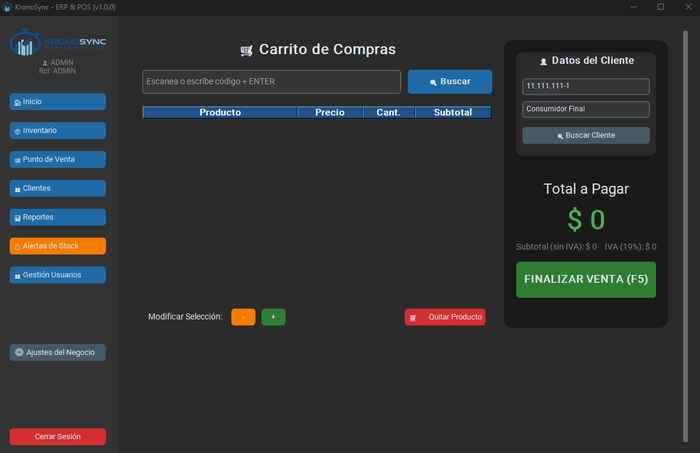
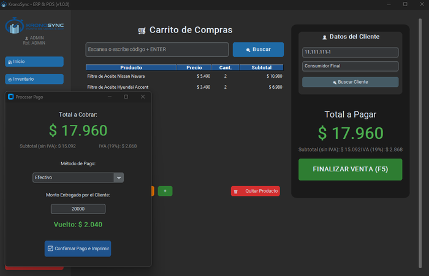

# Módulo de Ventas

El módulo de Ventas (Punto de Venta o POS) es el corazón operativo de KronoSync. Permite registrar ventas de forma rápida, con control de stock en tiempo real, validación de RUT y generación automática de boletas.

{: style="width: 700px; height: auto;"}

---

## Acceso

Todos los roles pueden acceder al Punto de Venta desde la barra lateral. Sin embargo, la **anulación de tickets** está restringida a ADMIN, DUENO y ADMINISTRADOR.

---

## Componentes de la pantalla

### Panel izquierdo: Carrito de compras

| Elemento | Función |
|----------|---------|
| Campo de código de barras | Escanea o escribe el código del producto + ENTER para agregar 1 unidad |
| Botón Buscar | Abre el buscador manual de productos |
| Tabla del carrito | Muestra: Producto, Precio, Cantidad, Subtotal |
| Botones +/- | Aumentan o disminuyen la cantidad del producto seleccionado |
| Botón Quitar Producto | Elimina el producto seleccionado del carrito |

### Panel derecho: Cliente y total

| Elemento | Función |
|----------|---------|
| RUT del cliente | Ingresa el RUT para buscar o registrar (por defecto: `11.111.111-1`) |
| Nombre del cliente | Se autocompleta si el RUT existe, o se ingresa manualmente |
| Botón Buscar Cliente | Busca el RUT en la base de datos |
| Total a Pagar | Muestra el total con IVA incluido, en formato CLP |
| Subtotal (sin IVA) | Monto neto antes de impuesto |
| IVA (19%) | Impuesto calculado automáticamente |
| Botón FINALIZAR VENTA (F5) | Abre el modal de pago |

---

## Flujo de venta detallado

### 1. Búsqueda de productos

#### Escaneo rápido (código de barras)

```python
# controllers/ventas_controller.py:74-78
def procesar_escaneo(self, event):
    codigo = self.vista.entry_barcode.get().strip()
    if codigo:
        self.agregar_al_carrito(codigo)
        self.vista.entry_barcode.delete(0, 'end')
```

Cada vez que presionas **Enter** con un código en el campo, el sistema:
1. Busca el producto por código exacto.
2. Verifica que haya stock disponible.
3. Si el producto tiene **múltiples lotes**, abre el modal de selección.
4. Si ya está en el carrito, aumenta la cantidad en 1.
5. Si no está, lo agrega con cantidad 1.
6. Si no hay stock, muestra advertencia y notifica al administrador.

!!! warning "Sin stock disponible"
    Si intentas agregar más unidades de las que existen en bodega, verás el mensaje "Quiebre de stock evitado" y la acción se cancela. El sistema envía una notificación al administrador.

#### Búsqueda manual (venta por volumen)

Al hacer clic en **Buscar**, se abre un modal de búsqueda donde puedes:

- Escribir parte del nombre o código del producto
- Ver resultados filtrados en tiempo real
- Hacer doble clic para seleccionar

Luego se abre el cuadro de diálogo **Venta por Volumen** donde ingresas la cantidad exacta a vender.

### 2. Gestión del carrito

El carrito es una lista en memoria con los siguientes campos por producto:

```python
{
    'codigo': '780F00001',
    'nombre': 'Filtro de Aceite Toyota Hilux',
    'precio': 5990,
    'cantidad': 2,
    'subtotal': 11980
}
```

!!! tip "Modificar cantidades"
    Selecciona cualquier producto en la tabla y usa los botones **+** y **-** para ajustar cantidades. Si la cantidad llega a 0, el producto se elimina automáticamente.

### Venta por Volumen (búsqueda manual)

Cuando necesitas vender una cantidad específica mayor a 1, usa el flujo de venta por volumen:

1. Haz clic en **Buscar**.
2. En la ventana emergente, escribe el nombre o código del producto. Los resultados se filtran en tiempo real.
3. Haz **doble clic** sobre el producto deseado.
4. Se abre el cuadro de diálogo **Venta por Volumen** con:
    - Nombre del producto
    - Stock máximo disponible (considerando lo que ya está en el carrito)
    - Campo para ingresar la cantidad exacta
5. Ingresa la cantidad (ej: `10`) y presiona **Enter** o haz clic en **Agregar al Carrito**.

El sistema valida que:
- La cantidad sea un número entero positivo
- No exceda el stock disponible en bodega
- Si la venta deja el stock bajo el mínimo, muestra advertencia y genera alerta automática

!!! warning "Stock insuficiente en venta por volumen"
    Si intentas agregar más unidades de las disponibles, el sistema muestra: "Solo puedes agregar hasta X unidades más" y cancela la acción.

### 3. Validación de RUT

El sistema implementa el algoritmo chileno de **Módulo 11** para validar RUTs:

- Limpia puntos y guiones automáticamente
- Separa el cuerpo del dígito verificador
- Calcula el DV esperado usando la serie 2,3,4,5,6,7
- Convierte resultados: 11 → `0`, 10 → `K`
- Si el DV no coincide, rechaza el ingreso

```python
# controllers/ventas_controller.py:30-50
def validar_y_formatear_rut(self, rut_ingresado):
    # ... algoritmo Módulo 11 completo
```

!!! warning "RUT inválido"
    Si ingresas un RUT con dígito verificador incorrecto, el sistema mostrará un error y no permitirá continuar con el cobro hasta que lo corrijas.

### 4. Modal de pago

Al presionar **F5** o **FINALIZAR VENTA**, se abre el modal con:

- **Total a cobrar**: en grande, con formato CLP
- **Desglose**: Subtotal (sin IVA) + IVA (19%)
- **Método de pago**: Efectivo, Tarjeta (Transbank) o Transferencia
- **Cálculo de vuelto**: solo visible en modo Efectivo

{: style="width: 700px; height: auto;"}

#### Efectivo

1. Ingresa el monto entregado por el cliente.
2. El vuelto se calcula en tiempo real:
    - `Vuelto = Monto entregado - Total`
    - Si el monto es menor, muestra "Faltan: $ X"
3. El botón de confirmación no permite continuar si el monto es menor al total.

#### Tarjeta o Transferencia

No requieren monto adicional. La venta se registra directamente con el método seleccionado.

### 5. Registro de la venta

Al confirmar el pago, el sistema ejecuta las siguientes operaciones en orden:

1. **Registra el cliente**: si el RUT no existe, pregunta si desea crearlo.
2. **Verifica alertas de stock**: por cada producto vendido, revisa si el stock remanente cae bajo el mínimo.
3. **Registra la venta**: inserta en las tablas `ventas` y `detalle_ventas`.
4. **Aplica FEFO**: descuenta las unidades de los lotes más próximos a vencer.
5. **Genera boleta PDF**: usando ReportLab, en formato ticketera térmica 80mm.
6. **Limpia el carrito**: restablece la pantalla para una nueva venta.

```python
# controllers/ventas_controller.py:317-367
def _ejecutar_cobro_final(self, rut_cli, metodo_pago):
    # 1. Registrar cliente si es nuevo
    # 2. Verificar alertas de stock bajo
    # 3. Registrar venta en BD
    # 4. Generar PDF
    # 5. Limpiar carrito
```

---

## Selección de lote durante la venta

Cuando un producto tiene **múltiples lotes** registrados, el sistema abre un modal de selección al agregarlo al carrito:

📷 *[Modal de selección de lote — pendiente de subir]*

| Opción | Comportamiento |
|--------|---------------|
| **Seleccionar lote manual** | Eliges de qué lote específico descontar. Útil si necesitas priorizar un lote próximo a vencer. |
| **Usar FEFO automático** | El sistema descuenta automáticamente del lote que vence primero. |

### Columna "Lote" en el carrito

La tabla del carrito ahora incluye una columna **Lote** que muestra de qué lote se descontará cada producto. Si el producto se agregó con FEFO automático, muestra "FEFO".

!!! info "Productos sin lotes"
    Los productos que no tienen lotes múltiples (un solo lote por defecto) no muestran el modal de selección. El descuento es directo.

---

Solo los roles **ADMIN**, **DUENO** y **ADMINISTRADOR** pueden anular ventas.

Para anular un ticket:

1. Ve al módulo **Reportes**.
2. Busca la venta que deseas anular.
3. Haz doble clic para abrir el detalle del ticket.
4. Haz clic en **Anular Venta**.
5. Confirma la acción.

Al anular una venta, el sistema **revierte el descuento de stock** (devuelve las unidades al inventario) y marca la venta como `ANULADA`.

!!! danger "La anulación es irreversible"
    Una vez anulada, la venta no puede reactivarse. Solo se marca como `ANULADA` en el historial para trazabilidad contable. El stock se devuelve al inventario automáticamente.

---

## Boleta PDF (80mm)

La boleta se genera automáticamente en formato ticketera térmica (80mm de ancho) e incluye:

| Sección | Contenido |
|---------|-----------|
| Cabecera | Nombre, RUT y dirección de la empresa |
| Datos de venta | N° ticket, fecha, vendedor, método de pago |
| Cliente | RUT y nombre |
| Detalle | Tabla con producto, cantidad, precio unitario y subtotal |
| Totales | Neto, IVA (19%) y Total |
| Pie | Mensaje de agradecimiento |

Las boletas se guardan en la carpeta `tickets_pdf/` organizadas por año y mes.

!!! info "Ubicación de las boletas PDF"
    Las boletas se almacenan en `tickets_pdf/YYYY/MM/` dentro de la carpeta de KronoSync. Ejemplo: `tickets_pdf/2026/05/Ticket_15.pdf`

!!! tip "Reimpresión de boletas"
    Puedes volver a ver e imprimir una boleta desde el módulo **Reportes**, haciendo doble clic en la venta y usando el botón **Ver PDF**.

---

## Atajos de teclado

| Tecla | Acción |
|-------|--------|
| **Enter** (en campo código) | Agregar producto escaneado |
| **Enter** (en campo RUT) | Buscar cliente |
| **F5** | Abrir modal de pago |

---

## Navegación relacionada

- [Inventario](inventario.md): gestiona el stock y los productos que vendes en el POS
- [Clientes](clientes.md): administra la cartera de clientes y la validación de RUT
- [Reportes](reportes.md): consulta el historial de ventas y anula tickets
- [Alertas](alertas.md): revisa las alertas de stock bajo que se generan durante las ventas
- [Dashboard](dashboard.md): ve el resumen de ventas del día
