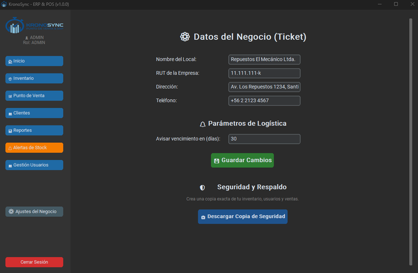

# Configuración inicial

Antes de empezar a vender, debes configurar los datos de tu empresa y los parámetros básicos del sistema. Este módulo está disponible solo para el rol **ADMIN**.

---

## Acceder a la configuración

1. Inicia sesión como `admin`.
2. En la barra lateral izquierda, haz clic en **Ajustes del Negocio**.

{: style="width: 700px; height: auto;"}

---

## Datos de la empresa

Completa el formulario con la información de tu negocio. Estos datos aparecerán en las boletas PDF, reportes y en la cabecera del sistema.

| Campo | Descripción | Obligatorio |
|-------|-------------|:-----------:|
| Nombre del Local | Razón social o nombre comercial | Sí |
| RUT | RUT de la empresa (formato: `12.345.678-9`) | Sí |
| Dirección | Dirección física del local | No |
| Teléfono | Número de contacto | No |

!!! tip "RUT de la empresa"
    Ingresa el RUT con puntos y guión (ej: `76.543.210-K`). El sistema almacena y muestra el valor tal cual lo ingresas.

### Ejemplo

```
Nombre del Local: Repuestos El Mecánico Ltda.
RUT: 76.543.210-K
Dirección: Av. Los Repuestos 1234, Santiago Centro
Teléfono: +56 2 2123 4567
```

---

## Días de alerta de stock

Define cuántos días antes del vencimiento el sistema debe generar alertas para productos perecederos.

| Parámetro | Valor sugerido |
|-----------|---------------|
| Días de alerta | 30 |

Un valor de `30` significa que los productos que venzan dentro de los próximos 30 días aparecerán en el **Centro de Alertas**.

!!! warning "Valor mínimo"
    El sistema requiere un número entero mayor a 0. No se aceptan decimales ni valores negativos.

---

## Respaldo de base de datos

Desde esta misma pantalla puedes crear una copia de seguridad de toda tu información.

1. Haz clic en el botón **Respaldar Base de Datos**.
2. Elige una ubicación segura (recomendado: una carpeta externa o pendrive).
3. El archivo se guardará con el nombre `Respaldo_ERP_Core_DD_MM_YYYY_HHMM.db`.

!!! warning "Importante"
    Realiza respaldos periódicos. La base de datos contiene toda la información de tu negocio (productos, ventas, clientes, usuarios). Ante cualquier falla del equipo, el respaldo es tu única protección.

!!! tip "Frecuencia recomendada"
    Haz un respaldo al final de cada día. Guarda el archivo en un pendrive o disco externo, no solo en el mismo equipo.

---

## Formato de moneda (CLP)

KronoSync trabaja con pesos chilenos (CLP) bajo las siguientes reglas, que no requieren configuración manual:

- **Sin decimales**: los montos se truncan a entero
- **Separador de miles**: punto (`.`)
- **Prefijo**: `$ ` (peso + espacio)

Ejemplo: `$ 1.234`

---

## Siguiente paso

Con los datos de tu empresa configurados, ya puedes realizar [Tu primera venta](primera-venta.md).

!!! tip "Gestión de usuarios"
    Después de configurar la empresa, crea cuentas para tus empleados desde el módulo [Gestión de Usuarios](../modulos/usuarios.md) (requiere rol ADMIN).
