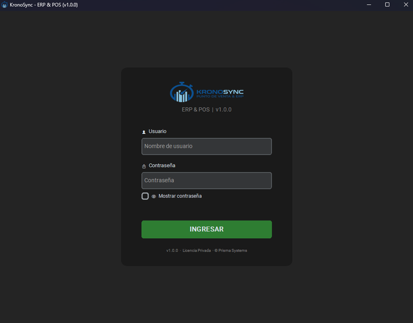
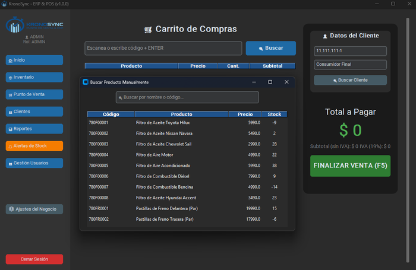
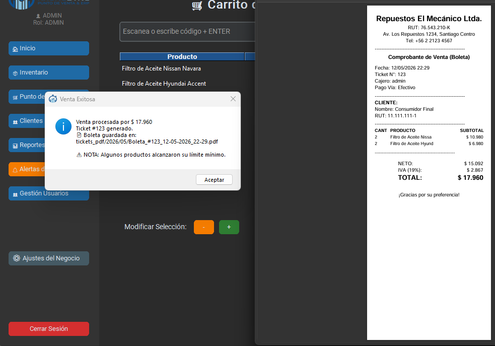

# Tu primera venta

Esta guía te lleva paso a paso por el proceso completo de venta en KronoSync: desde el escaneo del producto hasta la impresión de la boleta.

---

## Antes de empezar

Asegúrate de tener:

- [x] El sistema instalado y funcionando
- [x] La configuración de la empresa completada
- [x] Al menos un producto cargado en el inventario

Si aún no tienes productos, carga algunos desde **Inventario > Nuevo Producto** antes de continuar.

!!! note "¿No tienes productos?"
    Puedes ejecutar el script `seed_repuestos_mecanicos.py` para poblar la base de datos con productos y clientes de ejemplo. Ejecuta en terminal: `python seed_repuestos_mecanicos.py`

---

## Paso 1: Iniciar sesión

Abre KronoSync e inicia sesión con tu usuario. Todos los roles (ADMIN, DUENO, ADMINISTRADOR, CAJERO) pueden acceder al Punto de Venta.

{: style="width: 700px; height: auto;"}

---

## Paso 2: Navegar al Punto de Venta

En la barra lateral izquierda, haz clic en **Punto de Venta**. Verás la pantalla dividida en dos secciones:

- **Izquierda**: Carrito de compras, con tabla de productos y buscador
- **Derecha**: Datos del cliente y total a pagar

{: style="width: 700px; height: auto;"}

---

## Paso 3: Agregar productos al carrito

Tienes dos formas de agregar productos:

### Opción A: Escaneo rápido (código de barras)

1. Escribe o escanea el código de barras en el campo superior.
2. Presiona **Enter**.
3. El producto se agrega automáticamente con **1 unidad**. Cada nuevo Enter suma 1 unidad más.

{: style="width: 700px; height: auto;"}

### Opción B: Búsqueda manual (venta por volumen)

1. Haz clic en el botón **Buscar**.
2. Escribe el nombre o código del producto en la ventana emergente.
3. Haz doble clic sobre el producto deseado.
4. Ingresa la cantidad exacta en el cuadro de diálogo **Venta por Volumen**.
5. Confirma con **Enter** o el botón **Agregar al Carrito**.

!!! tip "Stock en tiempo real"
    El sistema no permite vender más unidades de las que existen en bodega. Si intentas exceder el stock, recibirás una advertencia y se notificará al administrador.

---

## Paso 4: Ajustar cantidades en el carrito

Una vez que los productos están en el carrito, puedes modificar las cantidades:

| Acción | Cómo hacerlo |
|--------|-------------|
| Aumentar 1 unidad | Selecciona el producto en la tabla y pulsa **+** |
| Disminuir 1 unidad | Selecciona el producto y pulsa **-** |
| Quitar producto | Selecciona el producto y pulsa **Quitar Producto** |

El total se recalcula automáticamente en cada cambio.

---

## Paso 5: Identificar al cliente

En el panel derecho, tienes dos opciones:

### Cliente por defecto

Si no ingresas ningún RUT, el sistema asigna automáticamente **Consumidor Final** (RUT `11.111.111-1`).

### Buscar o registrar cliente

1. Escribe el RUT del cliente en el campo correspondiente (formato: `12.345.678-9`).
2. Presiona **Enter** o haz clic en **Buscar Cliente**.
3. Si el RUT ya existe, se autocompletará el nombre.
4. Si el RUT es nuevo, ingresa manualmente el nombre. El cliente se registrará automáticamente al finalizar la venta.

!!! warning "Validación de RUT"
    El sistema valida el RUT usando el algoritmo de **Módulo 11** chileno. Si el dígito verificador no coincide, rechazará el ingreso y te pedirá corregirlo.

---

## Paso 6: Cobrar

Cuando el carrito esté listo:

1. Haz clic en **FINALIZAR VENTA (F5)** o presiona la tecla **F5**.
2. Se abrirá el modal de **Procesar Pago**, mostrando el total con desglose de IVA.

{: style="width: 700px; height: auto;"}

### Métodos de pago disponibles

| Método | ¿Cómo funciona? |
|--------|-----------------|
| **Efectivo** | Ingresa el monto entregado por el cliente. El sistema calcula automáticamente el vuelto. |
| **Tarjeta (Transbank)** | Pago con tarjeta. No requiere monto adicional. |
| **Transferencia** | Pago por transferencia bancaria. |

### Pago en efectivo

1. Selecciona **Efectivo** en el combo de método de pago.
2. Ingresa el monto que te entrega el cliente (ej: `20000`).
3. El sistema calcula el vuelto en tiempo real:
    - **Verde**: el monto cubre el total
    - **Rojo**: el monto es insuficiente (muestra cuánto falta)

4. Haz clic en **Confirmar Pago e Imprimir**.

!!! tip "Cálculo automático de vuelto"
    Si el cliente paga con un billete de mayor denominación, el vuelto se calcula instantáneamente al escribir el monto.

---

## Paso 7: Boleta y cierre

Al confirmar el pago, el sistema:

1. Registra la venta en la base de datos.
2. Descuenta automáticamente las unidades del inventario (usando **FEFO** si hay lotes).
3. Genera una **boleta PDF** formato ticketera térmica (80mm) con:
    - Datos de la empresa
    - Detalle de productos, cantidades y precios
    - Desglose de IVA (19%)
    - Datos del cliente
    - Método de pago
4. Muestra un mensaje de confirmación con la ruta del PDF generado.

{: style="width: 700px; height: auto;"}

### Después de la venta

- El carrito se vacía automáticamente.
- El cliente vuelve a **Consumidor Final** por defecto.
- La venta queda registrada en **Reportes** para consulta futura.

!!! note "¿Falló la generación del PDF?"
    Si la venta se registró exitosamente pero el PDF no se generó, verás un mensaje de advertencia con el detalle del error. La venta **no se pierde** — los datos quedan guardados en el historial.

---

## Resumen del flujo

```
Login → Punto de Venta → Escanear/Buscar producto → Agregar al carrito
→ Ingresar cliente (opcional) → F5 (Cobrar) → Elegir método de pago
→ Confirmar → Boleta PDF generada → Carrito limpio
```

---

## Siguientes pasos

- Aprende más sobre el [Módulo de Ventas](../modulos/ventas.md)
- Consulta cómo gestionar tu [Inventario](../modulos/inventario.md)
- Revisa el historial en [Reportes](../modulos/reportes.md)
- Gestiona tus [Clientes](../modulos/clientes.md)
- Monitorea el negocio desde el [Dashboard](../modulos/dashboard.md)
